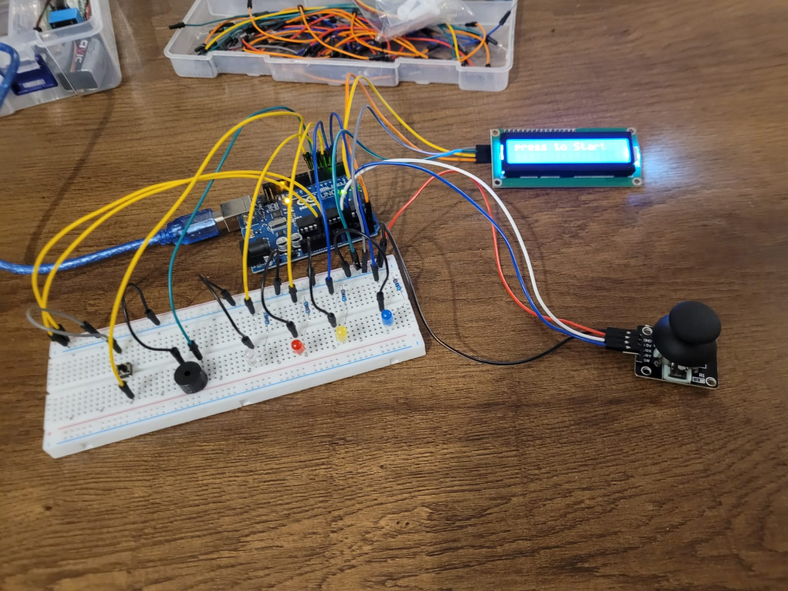
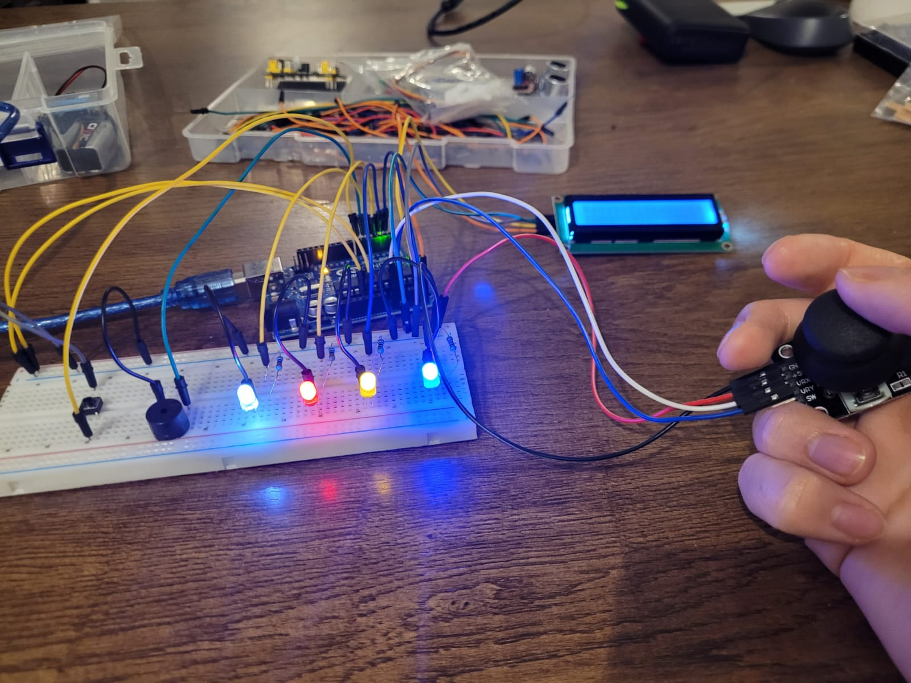
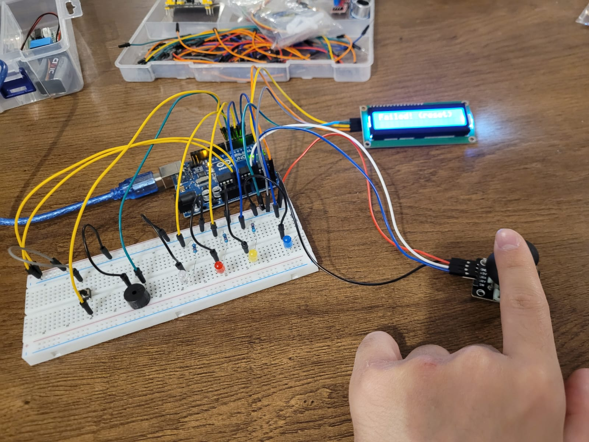
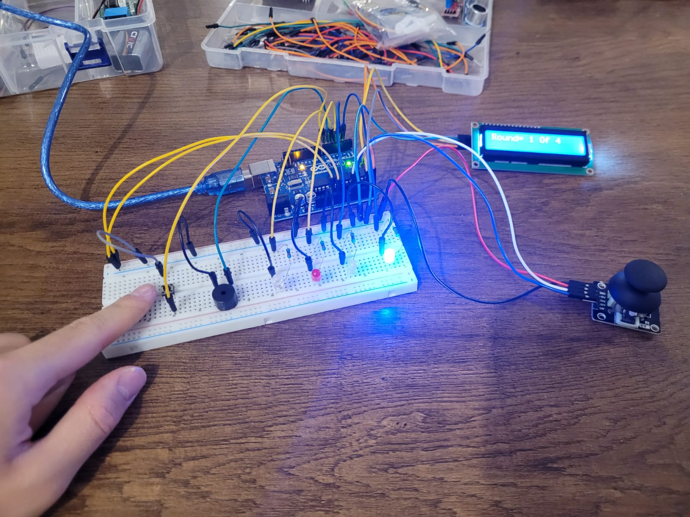

# Arduino---Memory-Test


# Descriptions:
This project is a memory game built using an Arduino, a joystick, four LEDs (red, yellow, blue, white), a buzzer, and an LCD screen.

When the Start button is pressed, the game begins and a sequence of LED blinks is played.
The player must memorize the LED pattern and input it correctly using the joystick. The game becomes harder with each round.

---

Joystick Direction Mapping:

This is the fixed color-to-direction mapping used in the joystick (control stick) throughout the game:

Up ---> Blue LED

Right ---> Yellow LED

Down ---> Red LED

Left ---> White LED


This mapping stays the same for the entire gameplay.

---

Game Logic:

The game starts by blinking a random sequence of 4 LEDs.

The player must reproduce the sequence using the joystick.

The LCD screen displays the current round (EX: "Round 2 Of 4").

If the player succeeds:

A new random LED is added to the sequence.

The game advances to the next round.


The game consists of 4 total rounds.

---

If all 4 rounds are completed correctly:

All LEDs blink together

A victory tone plays

The LCD displays: "You Won!"

---

If the player enters an incorrect direction:

An error tone plays

No LEDs blink

The LCD displays: "Failed"

---

To restart the game:

Press the Reset button

A new random sequence will be generated

---

This project is great for learning about:

Memory training

Joystick input

Arrays and sequences

Random generation

Visual and audio feedback using LEDs, buzzer, and LCD


# Pictures:






# Code Below:
```cpp
#include <LiquidCrystal_I2C.h>

LiquidCrystal_I2C lcd(0x27, 16, 2);


byte correctMoves[15];
byte moves[15];


byte blueLED = 2;
byte yellowLED = 3;
byte redLED = 4;
byte whiteLED = 5;
byte button = 7;
byte buzzer = 6;

byte currentLength = 4;
byte count = 0;
byte roundPlaying = 1;

bool checkDone = true;

int pinX = A0;
int pinY = A1;

int xRead, yRead;


void showOrderDirections() {
  for (byte i=0; i<currentLength; i++) {
    byte move = correctMoves[i];

    switch (move) {
      case 1:
        digitalWrite(blueLED, HIGH);
        tone(buzzer, 400);
        delay(700);
        noTone(buzzer);
        digitalWrite(blueLED, LOW);
        break;

      case 2:
        digitalWrite(yellowLED, HIGH);
        tone(buzzer, 500);
        delay(700);
        noTone(buzzer);
        digitalWrite(yellowLED, LOW);
        break;

      case 3:
        digitalWrite(redLED, HIGH);
        tone(buzzer, 600);
        delay(700);
        noTone(buzzer);
        digitalWrite(redLED, LOW);
        break;

      case 4:
        digitalWrite(whiteLED, HIGH);
        tone(buzzer, 700);
        delay(700);
        noTone(buzzer);
        digitalWrite(whiteLED, LOW);
        break;
    }
    

    delay(1000);
  }

}


void winnigScreen() {
  digitalWrite(redLED, HIGH);
  digitalWrite(blueLED, HIGH);
  digitalWrite(yellowLED, HIGH);
  digitalWrite(whiteLED, HIGH);
  tone(buzzer, 700);
  delay(1500);
  digitalWrite(redLED, LOW);
  digitalWrite(blueLED, LOW);
  digitalWrite(yellowLED, LOW);
  digitalWrite(whiteLED, LOW);
  noTone(buzzer);
}


void setup() {
  randomSeed(analogRead(A3));
  lcd.init();
  lcd.backlight();
  Serial.begin(9600);

  for (byte i=2; i<7; i++) {
    pinMode(i, OUTPUT);
  }

  pinMode(button, INPUT_PULLUP);

  while (digitalRead(button) == HIGH){ // Start button
    lcd.clear();
    lcd.print("press to Start");
    delay(10);  
  }

  for (byte z=0; z<4; z++) {
    correctMoves[z] = random(1,5);
  }

  lcd.clear();
}


void loop() {

  while (roundPlaying < 5 && checkDone == true) {
    lcd.clear();
    lcd.print("Round= ");
    lcd.print(roundPlaying);
    lcd.print(" Of 4");
    showOrderDirections();

    while (count < currentLength){
      xRead = analogRead(pinX); 
      yRead = analogRead(pinY);

      if (yRead < 420) {
        moves[count] = 1; // blue (UP)
        tone(buzzer, 400);
        digitalWrite(blueLED, HIGH);
        delay(700);
        digitalWrite(blueLED, LOW);
        noTone(buzzer);
        count++;
      }

      if (yRead > 620 ) {
        moves[count] = 3; // red (DOWN)
        tone(buzzer, 600);
        digitalWrite(redLED, HIGH);
        delay(700);
        digitalWrite(redLED, LOW);
        noTone(buzzer);
        count++;
      }

      if (xRead > 620 ) {
        moves[count] = 2; // yellow (RIGHT)
        tone(buzzer, 500);
        digitalWrite(yellowLED, HIGH);
        delay(700);
        digitalWrite(yellowLED, LOW);
        noTone(buzzer);
        count++;
      }

      if (xRead < 420 ) {
        moves[count] = 4; // white (LEFT)
        tone(buzzer, 700);
        digitalWrite(whiteLED, HIGH);
        delay(700);
        digitalWrite(whiteLED, LOW);
        noTone(buzzer);
        count++;
      }
    } // End collect moves


    // start check
    for (byte z=0; z<currentLength; z++) {
      if (moves[z] != correctMoves[z]) {
        checkDone = false;
        break;
      }
    }


    if (checkDone){ // correct
      Serial.println("Correct!");
      correctMoves[count] = random(1,5); // Add new move
      count = 0;
      currentLength++;
      roundPlaying++;
      delay(1000);
    }

    else{ // not correct
      Serial.println("Wrong!");
    }

    delay(100);

  } // End Of rounds


  if (roundPlaying == 5 && checkDone == true) { // WIN
    winnigScreen();

    while (true) {
      lcd.clear();
      lcd.print("You Won! (reset)");
      delay(10000);
    }
  }

  else{ // LOSE
    for (byte time=0; time<3; time++){
      tone(buzzer, 700);
      delay(1000);
      noTone(buzzer);
    }

    while (true){
      lcd.clear();
      lcd.print("Failed! (reset)");
      delay(10000);
    }
  }
}

```
